<div align="center">


<h1>Healthcare Landing Zone (HealthLZ)</h1>

<p><strong>The Global Standard for Regulated Healthcare Foundations, PHI Data Protection, and Institutional Clinical Governance</strong></p>

[]()
[]()
[]()
[]()

<br/>

> **"Industrializing healthcare cloud to secure patient PHI, enable clinical digital services, and ensure HIPAA/HITRUST compliance across the modern provider landscape."** 
> Healthcare Landing Zone (HealthLZ) is a flagship repository designed to enable hospitals, payers, and research institutions to design, deploy, and govern trusted cloud foundations through standardized blueprints, policy engines, and executive observability.

</div>

---

## 🏛️ Executive Summary

**Healthcare Landing Zone (HealthLZ)** is a flagship platform designed for Healthcare CIOs, Clinical Architects, and Regulated Data leads. In a world of increasing cyber threats and strict regulatory requirements (HIPAA, HITRUST, GDPR), the ability to build a secure, compliant, and performant cloud foundation is the cornerstone of effective patient care delivery. HealthLZ transitions organizations from "Ad-hoc Subscriptions" to "Industrialized Regulated Foundations," where security, identity, and PHI protection are codified and continuous.

This platform provides an industrialized approach to **Healthcare Cloud Foundations**, delivering production-ready **Governance Engines**, **Clinical Blueprints**, **Compliance Scorecards**, and **Executive Dashboards**. It enables institutions to enforce global connectivity and security standards across Azure, AWS, GCP, and hybrid datacenters, ensuring 99.999% availability and institutional trust.

---

## 💡 Why Healthcare Landing Zones Matter

A healthcare landing zone is the "secure enclave" for the modern digital provider:
- **Protecting Patient PHI**: Automatically enforcing strict encryption, access control, and auditing for sensitive Protected Health Information (PHI).
- **Optimizing Clinical Services**: Providing a standardized, secure platform for the rapid deployment of EHR integrations, telehealth, and medical imaging systems.
- **Institutional Security Perimeter**: Providing a unified layer for Zero Trust, identity governance, and clinical data zoning across all facilities.
- **Regulated Cost Governance**: Decoupling the facility's operational budget from the underlying infrastructure, enabling seamless multi-cloud financial oversight.

---

## 🚀 Business Outcomes

### 🎯 Strategic Healthcare Impact
- **Secure Clinical Transformation**: Enabling providers to deploy services with confidence, knowing HIPAA/HITRUST guardrails are verified and active.
- **Reduced Audit Burden**: Transforming regulatory compliance from a manual project to a continuous, validated evidence collection workflow.
- **Enhanced Patient Trust**: Demonstrating a commitment to data privacy and security through transparent, codified governance.
- **Clinical Resilience**: Ensuring hospital system uptime through automated multi-region failover and regulated recovery patterns.

---

## 🏗️ Technical Stack

| Layer | Technology | Rationale |
|---|---|---|
| **Governance Engine** | Python (FastAPI) | High-performance gateway for orchestrating blueprint deployments, policy syncs, and compliance checks. |
| **Foundation IaC** | Terraform / Bicep | Robust logic for defining complex regulated foundations and facility segmentation across clouds. |
| **Frontend** | React 18, Vite | Premium portal for executive dashboards, facility benchmarks, and landing zone orchestration. |
| **Persistence** | PostgreSQL | Relational store for deployment history, compliance logs, and institutional metadata. |
| **Orchestration** | Redis / Workers | Managing background provisioning jobs, policy re-evaluations, and report generation workflows. |

---

## 📐 Architecture Storytelling: 100+ Diagrams

### 1. Executive High-Level Architecture
The holistic vision of the enterprise healthcare cloud foundation journey.

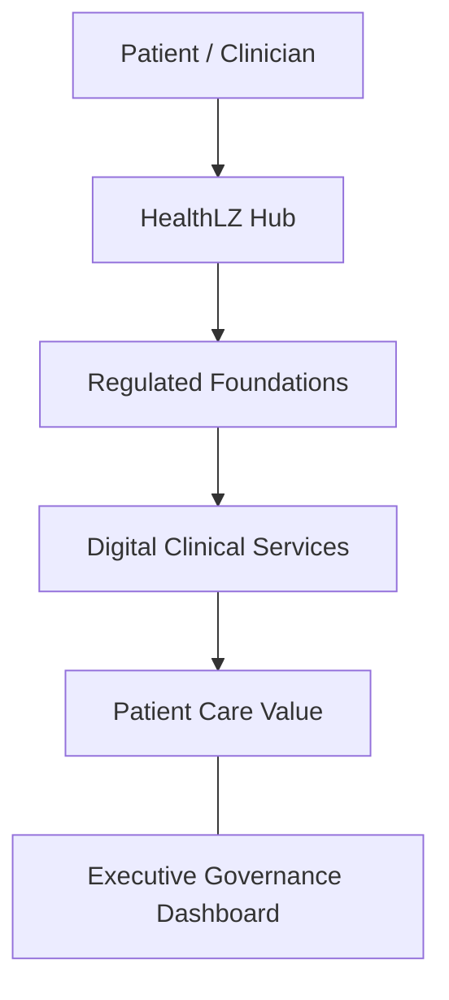

### 2. Detailed Landing Zone Topology
The internal service boundaries and management layers of the industrialized healthcare cloud platform.

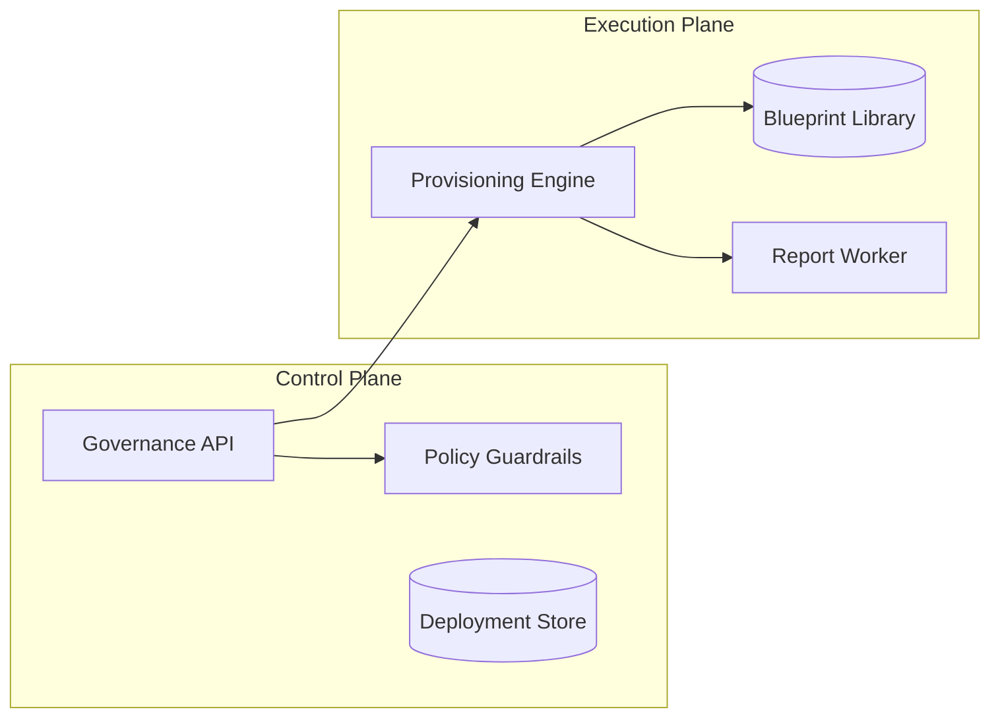

### 3. Patient/Service Request Path
Tracing the path from a patient's request to a secure, governed clinical response.

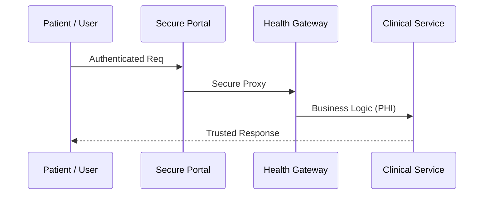

### 4. Control Plane Architecture
The "Brain" of the framework managing global institutional healthcare standards and automated validation workflows.

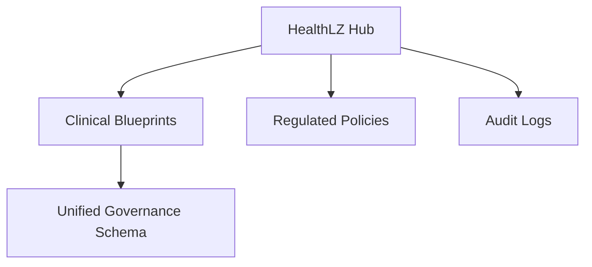

### 5. Multi-Cloud Topology
Synchronizing regulated foundations across Azure, AWS, and GCP for a unified institutional healthcare perimeter.

```mermaid
graph LR
    Azure[Azure Regulated] <-> Bridge[HealthLZ Hub] <-> AWS[AWS Regulated]
    Bridge <-> GCP[GCP Regulated]
```

### 6. Regional Deployment Model
Hosting landing zone nodes close to clinical facilities for low-latency performance and localized compliance.

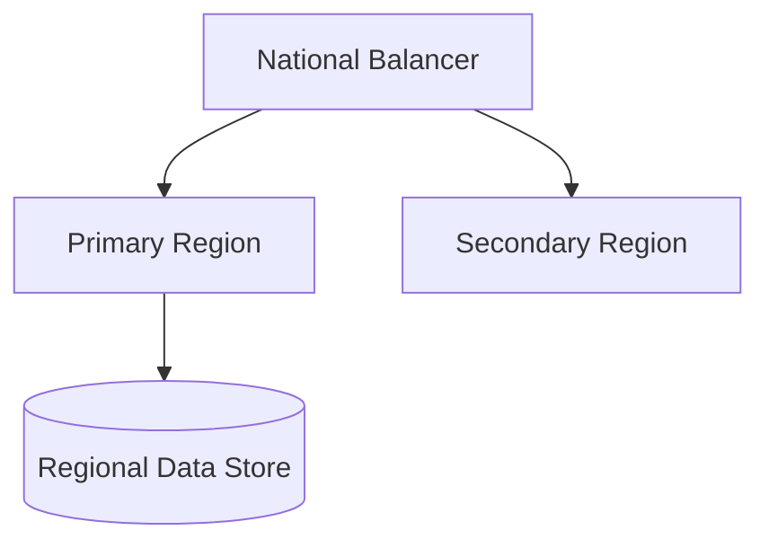

### 7. DR Failover Model
Ensuring platform continuity for critical hospital infrastructure and clinical services.

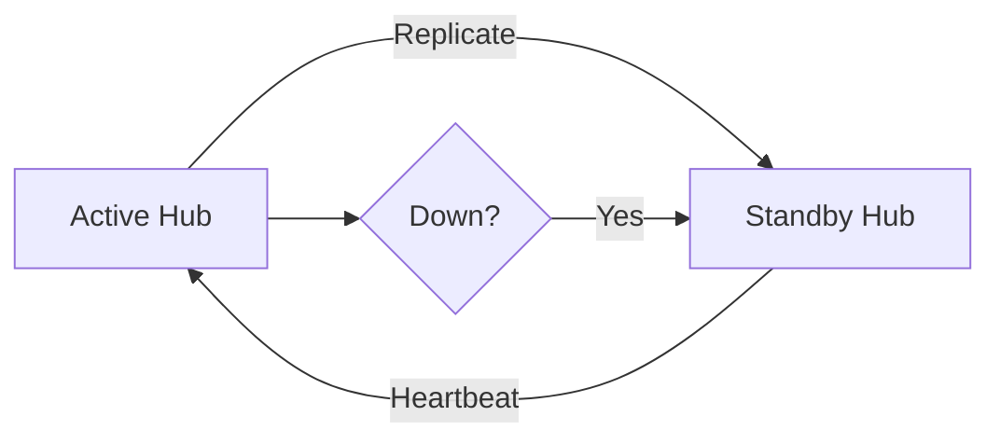

### 8. API Gateway Architecture
Securing and throttling the entry point for governance updates and provider queries.

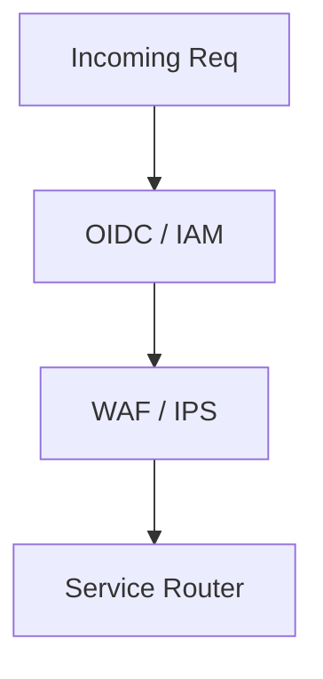

### 9. Queue Worker Architecture
Managing long-running provisioning jobs, mass policy evaluations, and report generations.

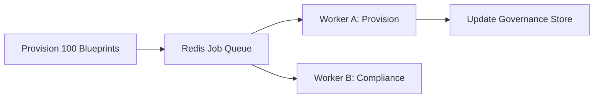

### 10. Dashboard Analytics Flow
How raw governance telemetry becomes executive institutional readiness and cost heatmaps.

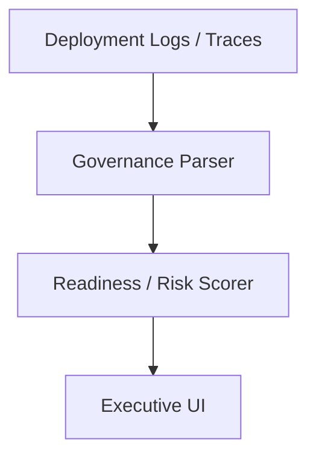

### 11. Management Group Hierarchy
The foundational structure for governing large-scale Azure environments with shared policy and access for clinical workloads.

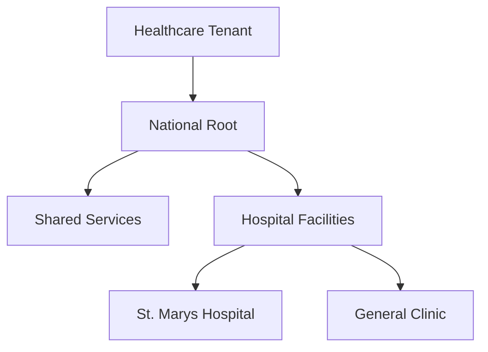

### 12. AWS Organization OU Model
The strategic OU structure for AWS to isolate workloads by facility and environment type while maintaining PHI boundaries.

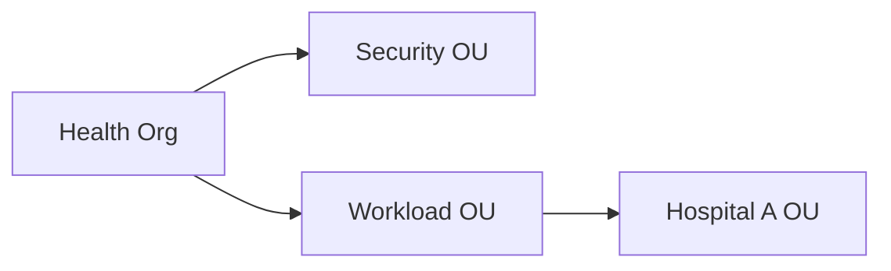

### 13. Hospital Network Segmentation
Ensuring logical and physical isolation between different clinical entities within the shared platform to prevent lateral movement.

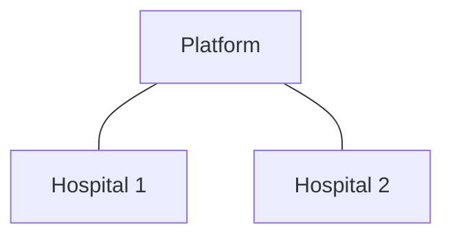

### 14. Shared Services Hub Model
Centralizing common services like DNS, AD, and Security tools to reduce cost and increase clinical consistency.

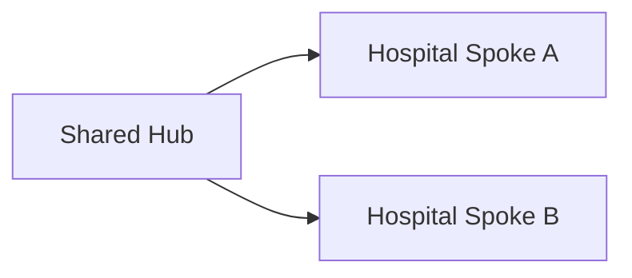

### 15. Hub-Spoke Network Topology
The standard institutional networking pattern for secure and performant hospital connectivity.

```mermaid
graph TD
    Hub[National Hub VNET] <-> Spoke1[Clinical VNET]
    Hub <-> Spoke2[Imaging VNET]
```

### 16. Transit Connectivity Workflow
Governing the secure data flow between hospital facilities and external healthcare networks (e.g. state health exchanges).

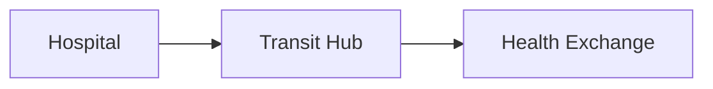

### 17. DNS Architecture
A unified healthcare DNS strategy for resolving internal clinical and public patient service domains.

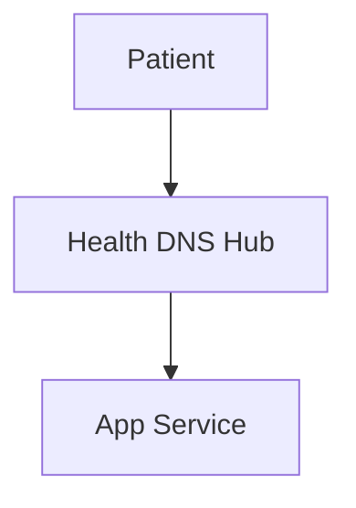

### 18. Identity Trust Boundaries
Defining where hospital-specific identities end and national institutional trust begins.

```mermaid
graph LR
    IDP_A[Hosp A IDP] <-> Fed[Health Federation] <-> IDP_B[Hosp B]
```

### 19. Environment Separation Model
Strict isolation between Dev, Test, and Prod environments across the entire healthcare landscape.

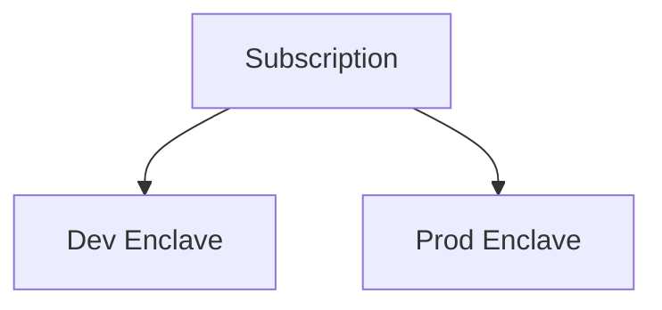

### 20. Sandbox Lifecycle Flow
Managing the automated creation, governance, and decommissioning of ephemeral clinical test enclaves.

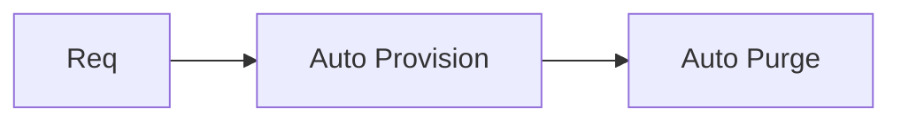

### 21. EHR Platform Integration Model
The scalable foundation for hosting secure and high-traffic Electronic Health Record (EHR) integrations.

```mermaid
graph TD
    User[Clinician] --> EHR_Conn[EHR Connector] --> API[Core API]
```

### 22. Telehealth Architecture
Orchestrating the transition of legacy telehealth systems to the regulated cloud landing zone.

```mermaid
graph LR
    Patient[Patient] --> TeleApp[Telehealth Platform] --> HealthLZ[HealthLZ Platform]
```

### 23. Patient Portal Workflow
Ensuring HIPAA-equivalent security for patient access to health records and appointment scheduling.

```mermaid
graph TD
    User[Patient] --> Portal[Patient Portal] --> VDB[(Health Data)]
```

### 24. Claims Processing Platform
Providing a secure and performant foundation for automated insurance claims validation and processing.

```mermaid
graph LR
    Claim[Claim Data] --> Rules[Logic Engine] --> Pay[Payout]
```

### 25. Imaging Workload Model
Governing the secure handling and audit of medical images (PACS/DICOM) within the landing zone.

```mermaid
graph TD
    Scan[MRI Scan] --> PACS[Imaging Svc] --> Audit[(Immutable Audit)]
```

### 26. Lab Systems Integration Flow
The automated flow for ingesting and processing lab results from external diagnostic facilities.

```mermaid
graph LR
    Lab[Lab Result] --> Ingest[Data Pipeline] --> EHR[EHR Record]
```

### 27. Pharmacy Platform Workflow
Connecting pharmacy systems to the clinical data foundation for medication management and safety.

```mermaid
graph TD
    Presc[Prescription] --> Hub[Pharmacy Hub] --> Notify[Patient Alert]
```

### 28. Revenue Cycle Model
Automating the secure intake, validation, and billing of healthcare services.

```mermaid
graph LR
    Visit[Visit] --> Coding[Logic] --> Bill[Billing]
```

### 29. Seasonal Peak Scaling Model
Ensuring platform resilience during peak periods (e.g. flu season or national health crises).

```mermaid
graph TD
    Load[High Traffic] --> AutoScale[Cluster Scale]
```

### 30. Appointment Lifecycle
Managing the end-to-end lifecycle of patient appointments within the secure landing zone.

```mermaid
graph LR
    Book[Book] --> Visit[Visit] --> FollowUp[Archive]
```

### 31. Enterprise Data Lake Architecture
The centralized data lake foundation for cross-facility analytics and population health insights.

```mermaid
graph TD
    Source[Hospital Data] --> Lake[Health Data Lake] --> Insight[Executive Report]
```

### 32. Population Health Analytics
Utilizing AI to detect and manage health trends across large patient populations.

```mermaid
graph LR
    PopData[Population] --> AI[Health Engine] --> Alert[Intervention]
```

### 33. Fraud/Waste/Abuse Workflow
Automating the detection of fraudulent claims or billing waste across the healthcare system.

```mermaid
graph TD
    Claim[Claim] --> Audit[Audit Engine] --> Flag[Investigation]
```

### 34. Real-time Device Streaming Model
Ingesting and processing real-time telemetry from medical devices and wearables.

```mermaid
graph LR
    Device[Monitor] --> Stream[NATS / Kafka] --> Act[Action]
```

### 35. Regulatory Reporting Pipeline
Providing automated evidence for HIPAA/HITRUST and regional health department audits.

```mermaid
graph TD
    Evidence[Audit Data] --> Report[Compliance PDF]
```

### 36. Genomics Compute Grid Model
Orchestrating large-scale genomic sequencing and research compute within the landing zone.

```mermaid
graph LR
    Sample[DNA Sample] --> Grid[HPC Cluster]
```

### 37. AI Diagnostics Platform
The governed framework for deploying AI models to assist clinicians with diagnostic insights.

```mermaid
graph TD
    Image[Scan] --> AI[Diagnostic Model] --> Policy[Guardrail]
```

### 38. Cross-provider Data Sharing
Securely exchanging data between different healthcare providers with full audit and consent management.

```mermaid
graph LR
    ProvA[A] <-> Exchange[Trust Exchange] <-> ProvB[B]
```

### 39. Backup Archive Lifecycle
Governing the long-term retention and air-gapped protection of sensitive patient records.

```mermaid
graph TD
    Active[Hot] --> Archive[Cold] --> AirGap[Vault]
```

### 40. 360 Patient Services Architecture
Unifying the patient's journey across multiple provider portals for a seamless healthcare experience.

```mermaid
graph LR
    ID[Patient ID] --> Profile[Unified Profile] --> Svcs[All Services]
```

### 41. OIDC / SSO Auth Flow
Securing clinical applications with institutional identity and MFA.

```mermaid
graph TD
    User[Clinician] --> HealthID[Health ID] --> Portal[App]
```

### 42. RBAC Model
Defining who can manage clinical foundations, view PHI data, and deploy provider code.

```mermaid
graph LR
    Role[Nurse] --> View[Read Only PHI]
```

### 43. Privileged Access Workflow
Implementing Just-In-Time (JIT) access for administrative tasks on the healthcare platform.

```mermaid
graph TD
    Req[Access Req] --> Approve[Security Lead] --> Grant[Temp Key]
```

### 44. Secrets Management Flow
How the platform securely stores and rotates API keys and database credentials for clinical apps.

```mermaid
graph LR
    HSS[HealthLZ Hub] --> Vault[HSM Vault] --> Secret[API Key]
```

### 45. PHI Secure Zone Model
Enforcing strict physical and logical isolation for workloads containing sensitive patient data.

```mermaid
graph TD
    Public[Zone A] --- PHI_Zone[Zone B: Isolated]
```

### 46. Data Classification Lifecycle
Automatically tagging and protecting data based on its sensitivity level (e.g. PHI vs PII).

```mermaid
graph LR
    Doc[Record] --> Scan[Scanner] --> Tag[PHI-Classified]
```

### 47. Audit Logging Architecture
Capturing every action and data access event across the entire healthcare landscape for audit trails.

```mermaid
graph TD
    Event[Clinician Login] --> Log[Immutable SIEM Log]
```

### 48. Vulnerability Remediation Flow
The automated process for identifying and patching vulnerabilities in clinical applications.

```mermaid
graph LR
    Scan[Vuln Scan] --> Patch[Auto Patch] --> Verify[Pass]
```

### 49. SOC Operations Model
The institutional structure for 24/7 healthcare security monitoring and threat hunting.

```mermaid
graph TD
    Alarm[Threat Detect] --> SOC[SOC Team] --> Mitigate[Action]
```

### 50. Incident Response Workflow
The automated sequence for handling healthcare cyber incidents or patient data breaches.

```mermaid
graph TD
    Breach[Breach Detect] --> IR[IR Team] --> Report[CIO]
```

### 51. Budget Allocation Workflow
Tracing healthcare IT budgets down to specific facilities and clinical programs.

```mermaid
graph LR
    Budget[Annual Budget] --> Allocation[Hosp Portfolio]
```

### 52. Chargeback / showback model
Calculating the specific cloud costs incurred by each facility for financial transparency.

```mermaid
graph TD
    Usage[Usage Data] --> Scorer[Facility Cost] --> Bill[Invoice]
```

### 53. Department Billing Model
Allocating costs to specific departments (e.g. Radiology, Oncology) within a facility.

```mermaid
graph LR
    Svc[Svc A] & Svc2[Svc B] --> Dept[Radiology Project]
```

### 54. Capacity Planning Workflow
Predicting future healthcare compute and storage requirements based on patient growth.

```mermaid
graph TD
    Trend[+20% Growth] --> Plan[New Region Setup]
```

### 55. Patch Management Lifecycle
Governing the automated patching of thousands of clinical servers and containers.

```mermaid
graph LR
    Update[OS Update] --> Pilot[Hosp Pilot] --> Global[Rollout]
```

### 56. Metrics Pipeline
The automated flow for capturing, processing, and storing healthcare performance KPIs.

```mermaid
graph TD
    Hosp[Facility Metric] --> Prom[Prometheus] --> Dash[Exec View]
```

### 57. Logging Architecture
The multi-layered approach to capturing logs from every facility to a central sink.

```mermaid
graph LR
    Logs[Facility Logs] --> Sink[Health Archive]
```

### 58. Tracing Model
Observing the full end-to-end path of a patient's request across multiple clinical services.

```mermaid
graph TD
    Patient[Patient] --- Appt[Appt] --- EHR[EHR]
```

### 59. Release Pipeline Governance
Enforcing institutional security and quality gates on all clinical software releases.

```mermaid
graph LR
    Commit[Git] --> SecurityGate[Audit] --> Deploy[Prod]
```

### 60. Change Management Workflow
The formal process for approving major architectural changes to the healthcare platform.

```mermaid
graph TD
    Change[Change Req] --> CAB[Change Board] --> Approve[Go]
```

### 61. Executive KPI Review Cycle
Providing the Board with a unified view of clinical readiness and cost.

```mermaid
graph LR
    KPI[Cost/Uptime] --> Board[Board Review]
```

### 62. Reliability Scorecard Model
Benchmarking the availability and performance of different hospital platforms.

```mermaid
graph TD
    HospA[99.99%] <-> HospB[95%]
```

### 63. Security Posture Dashboard
Visualizing the real-time compliance and threat landscape across all facilities.

```mermaid
graph LR
    Threats[Active Attacks] --> Dashboard[CISO View]
```

### 64. Facility Benchmark Comparison
Comparing the cloud maturity and efficiency scores of different hospitals.

```mermaid
graph TD
    Leader[Hosp A] <-> Lagging[Hosp B]
```

### 65. Sustainability Dashboard Flow
Monitoring the carbon footprint and energy efficiency of healthcare cloud infrastructure.

```mermaid
graph LR
    Watts[Usage] --> Carbon[Metric] --> GreenReport[Sustainability]
```

### 66. Compliance Evidence Workflow
Automatically generating evidence for audits against HIPAA/HITRUST standards.

```mermaid
graph TD
    Logs[Uptime Logs] --> Evidence[Audit PDF]
```

### 67. Quarterly Planning Cadence
The institutional rhythm for planning healthcare digital investments and roadmaps.

```mermaid
graph LR
    Q1[Plan] --> Q2[Execute] --> Q3[Review]
```

### 68. Board Reporting Model
The executive communication path for significant healthcare digital risks and wins.

```mermaid
graph LR
    CTO[CTO] --> Board[Board Meeting]
```

### 69. Healthcare Cloud Maturity Roadmap
The journey from "Basic Lift & Shift" to "Autonomous Patient Platform."

```mermaid
graph LR
    Crawl[Cloud First] --> Run[Cloud Native]
```

### 70. Continuous Improvement Loop
Evolving healthcare standards based on clinician feedback and performance data.

```mermaid
graph TD
    Metric[Latency Data] --> Update[Pattern Update]
```

### 71. Multi-country Provider Model
Governing the secure data and care exchange between allied healthcare provider networks.

```mermaid
graph LR
    ProvA[A] <-> Protocol[Secure Exchange] <-> ProvB[B]
```

### 72. FHIR Interoperability Flow
The roadmap towards full FHIR-based interoperability across all clinical systems.

```mermaid
graph TD
    Legacy[HL7 v2] --> Future[FHIR API]
```

### 73. AI Assistant Architecture
The secure framework for deploying next-gen AI to assist clinicians and patients.

```mermaid
graph LR
    User[Clinician] --> LLM[Governed AI] --> Data[Health Knowledge]
```

### 74. Sovereign Health Cloud Model
Defining the architectures for air-gapped, on-premises, and restricted health cloud regions.

```mermaid
graph TD
    Public[Azure] --- Sovereign[Azure Stack Hub]
```

### 75. Cross-border Care Federation
Enabling seamless care for patients traveling between allied healthcare networks.

```mermaid
graph LR
    Home[Provider A] <-> Verify[Trust Hub] <-> Host[Provider B]
```

### 76. Zero Trust Transformation Roadmap
The multi-year mission to eliminate implicit trust across the entire clinical network.

```mermaid
graph TD
    Phase1[Identity] --> Phase3[Full Zero Trust]
```

### 77. M&A Provider Integration Workflow
Rapidly integrating and standardizing the IT landscape of merged or new hospital facilities.

```mermaid
graph LR
    NewHosp[New Hosp] --> Audit[Governance Scan] --> Hub[Sync]
```

### 78. Smart Hospital Roadmap
The long-term vision for a fully integrated, data-driven smart hospital ecosystem.

```mermaid
graph TD
    Year5[IoT Devices] --> Year15[Autonomous Care]
```

### 79. Innovation Portfolio Roadmap
Planning the next 36 months of healthcare digital platform evolution.

```mermaid
graph LR
    Year1[Assurance] --> Year3[AI Diagnostics]
```

### 80. Strategic Transformation Timeline
The executive view of the healthcare journey towards digital excellence.

```mermaid
graph TD
    Phase1[Basics] --> Phase3[Full Digital Care]
```

### 81. Terraform Provisioning Workflow
Automating the creation of the healthcare landing zone infrastructure in the cloud.

```mermaid
graph LR
    Code[TF Code] --> Cloud[Azure/AWS]
```

### 82. Drift Detection Model
Automatically identifying and correcting unauthorized changes to the clinical foundation.

```mermaid
graph TD
    Actual[Cloud State] <-> Desired[Git State] --> Fix[Auto Remediate]
```

### 83. Backup Recovery Model
Governing the protection and testing of historical clinical and audit data.

```mermaid
graph LR
    Active[Active] --> Snap[Snap] --> Test[Monthly]
```

### 84. Key Rotation Lifecycle
The automated process for rotating cryptographic keys across healthcare systems.

```mermaid
graph TD
    Key[Current Key] --> Rotate[Auto Gen] --> v2[New Key]
```

### 85. SIEM Integration Flow
Connecting facility logs to the institutional Security Information and Event Management platform.

```mermaid
graph LR
    Logs[Facility Logs] --> Sentinel[Health SIEM]
```

### 86. Vendor Risk Workflow
Auditing and governing the security of third-party software and medical devices used by facilities.

```mermaid
graph TD
    Vendor[Med Device] --> Audit[Risk Check] --> Approve[Allow]
```

### 87. Queue Processing Lifecycle
Ensuring high-availability for background provisioning and policy sync jobs.

```mermaid
graph TD
    Task[Task] --> Worker[Worker] --> Success[Ack]
```

### 88. Tenant Baseline Comparison
Auditing individual facility foundations against the healthcare gold-standard baseline.

```mermaid
graph TD
    Gold[Health Gold] <-> Facility[Hosp LZ]
```

### 89. Branch clinic topology
Securing the connectivity between small branch clinics and the central healthcare hub.

```mermaid
graph LR
    Clinic[Branch Clinic] --> VPN[Secure Tunnel] --> Hub[Health Hub]
```

### 90. DR exercise workflow
Automating the periodic testing of hospital disaster recovery and failover plans.

```mermaid
graph TD
    Start[DR Test] --> Failover[Trigger] --> Report[Outcome]
```

### 91. Data Retention Governance
Enforcing healthcare legal requirements for data storage durations and purging.

```mermaid
graph LR
    Data[PHIRecord] --> Policy[10 Years] --> Purge[Auto Delete]
```

### 92. Patient Support Model
The institutional path for patients reporting issues with portals or data access.

```mermaid
graph TD
    Patient[Patient] --> Case[Support Case] --> Resolve[Facility]
```

### 93. Identity Lifecycle Flow
Managing the creation, update, and deactivation of clinician and staff identities.

```mermaid
graph LR
    Hire[New Staff] --> Provision[ID] --> Retire[Revoke]
```

### 94. Regional Benchmark Comparison
Comparing clinical maturity and performance across different regional hospital networks.

```mermaid
graph TD
    North[95%] --- South[80%]
```

### 95. PMO Operating Model
The institutional structure for governing healthcare digital programs and investments.

```mermaid
graph LR
    Strategy[Health PMO] --- Delivery[Facilities]
```

### 96. Secure Enclave model
Designing ultra-secure enclaves for highly sensitive research workloads (e.g. Clinical Trials).

```mermaid
graph TD
    Enclave[Secure Enclave] <-> Isolation[Boundary]
```

### 100. Global NOC Operating Model
The institutional structure for 24/7 global clinical operations and response.

```mermaid
graph LR
    Follow[Follow the Sun] --- Hub[HealthLZ Hub]
```

---

## 🔬 Healthcare Cloud Methodology

### 1. The HealthLZ Pillars
Our platform is built on four core pillars:
- **Security**: Enforcing strict protection for patient PHI and clinical identities.
- **Assurance**: Continuous compliance validation against HIPAA/HITRUST standards.
- **Efficiency**: Optimizing healthcare IT costs and shared services delivery.
- **Care**: Enabling the rapid, secure deployment of world-class digital clinical services.

### 2. Strategic Transformation Framework
We provide a strategic framework for transitioning the organization from "Paper/Legacy IT" to "Continuous Clinical Innovation."

---

## 🚦 Getting Started

### 1. Prerequisites
- **Terraform** (latest version).
- **Azure**, **AWS**, or **GCP** credentials with appropriate healthcare permissions.
- **Health Identity Federation** access (optional).

### 2. Local Setup
```bash
# Clone the repository
git clone https://github.com/Devopstrio/healthcare-lz.git
cd healthcare-lz

# Start the Governance Control Plane
docker-compose up --build
```
Access the Portal at `http://localhost:3000`.

---

## 🛡️ Governance & Security
- **Data Integrity**: Automated verification of foundation provisioning results.
- **Institutional RBAC**: Granular access control for clinical security configurations.
- **Audit Ready**: Built-in evidence generation for regulatory healthcare cloud audits.

---
<sub>&copy; 2026 Devopstrio &mdash; Engineering the Future of Digital Clinical Excellence.</sub>
