<div align="center">


<h1>Healthcare Landing Zone</h1>

<p><strong>The Institutional-Grade Platform for Regulated Clinical Foundations, PHI Data Protection, and FHIR-Driven Health Orchestration.</strong></p>

[]()
[]()
[]()

<br/>

> **"Industrializing healthcare cloud to secure patient PHI."** 
> **Healthcare Landing Zone** is an enterprise-grade platform designed to provide a secure, measurable, and highly automated foundation for global clinical operations. It orchestrates the complex lifecycle of healthcare infrastructure—from multi-cloud tenant provisioning and HL7/FHIR ingestion to distributed PHI guardrails and unified clinical auditing.

</div>

---

## 🏛️ Executive Summary

Fragmented clinical silos and manual tenant provisioning are strategic operational liabilities; lack of centralized healthcare orchestration is a primary barrier to organizational clinical maturity. Organizations fail to maintain a secure healthcare foundation not because of a lack of tenants, but because of fragmented landing zone standards, lack of automated PHI validation, and an inability to orchestrate healthcare landing zones with operational precision.

This platform provides the **Healthcare Intelligence Plane**. It implements a complete **Enterprise Healthcare-Landing-Zone-as-Code Framework**, enabling Clinical and Platform teams to manage global healthcare foundations as first-class citizens. By automating the identification of compliance bottlenecks through real-time telemetry analysis and orchestrating the deployment of secure FHIR-driven data pipelines, we ensure that every organizational service—from core EHR systems to distributed patient portals—is governed by default, audited for history, and strictly aligned with institutional healthcare frameworks.

---

## 📐 Architecture Storytelling: Principal Reference Models

### 1. Principal Architecture: Global Healthcare Landing Zone & Patient Data Intelligence Plane
This diagram illustrates the end-to-end flow from multi-cloud tenant ingestion and HL7/FHIR orchestration to PHI guardrail enforcement, security validation, and institutional healthcare auditing.

```mermaid
graph LR
    %% Subgraph Definitions
    subgraph ClinicalIngress["Clinical & Patient Ingress"]
        direction TB
        EHR_Systems["Epic / Cerner / Legacy HL7"]
        Patient_Portals["Web & Mobile Health Apps"]
        Diagnostic_Devices["Imaging / Wearables / Lab IoT"]
    end

    subgraph IntelligenceEngine["Healthcare Intelligence Hub"]
        direction TB
        API["FastAPI Health Gateway"]
        FHIR_Orchestrator["HL7 & FHIR Data Pipe Hub"]
        PHIGuardrail_Hub["PHI Protection & Access Hub"]
        ComplianceHub["HIPAA & HITRUST Risk Hub"]
    end

    subgraph OperationsPlane["Distributed Healthcare Fleet"]
        direction TB
        TenantWorkers["Managed Tenant & Resource Provisioners"]
        PHIGateways["Secure Patient Data Gateways"]
        AuditProxies["Forensic Clinical Review Proxies"]
    end

    subgraph OperationsHub["Institutional Healthcare Hub"]
        direction TB
        Scorecard["Healthcare Maturity Scorecard"]
        Analytics["PHI Flow & Interop Velocity Stats"]
        Audit["Forensic Healthcare Metadata Lake"]
    end

    subgraph DevOps["Healthcare-LZ-as-Code Framework"]
        direction TB
        TF["Terraform Clinical Modules"]
        DriftBot["PHI & Config Drift Validator"]
        ChatOps["Clinical Operations Hub"]
    end

    %% Flow Arrows
    ClinicalIngress -->|1. Submit Healthcare Request| API
    API -->|2. Orchestrate FHIR| FHIR_Orchestrator
    FHIR_Orchestrator -->|3. Apply PHI Policy| PHIGuardrail_Hub
    PHIGuardrail_Hub -->|4. Assess Compliance| ComplianceHub
    
    ComplianceHub -->|5. Execute Provision| OperationsPlane
    OperationsPlane -->|6. Notify Status| ChatOps
    API -->|7. Visualize Health| Scorecard
    
    Scorecard -->|8. Track Maturity| Analytics
    Scorecard -->|9. Record Provision| Audit
    
    TF -->|10. Provision Backbone| IntelligenceEngine
    DriftBot -->|11. Inject PHI Risk| FHIR_Orchestrator
    Audit -->|12. Improve Operations| TenantWorkers

    %% Styling
    classDef ingress fill:#f5f5f5,stroke:#616161,stroke-width:2px;
    classDef intel fill:#e8eaf6,stroke:#1a237e,stroke-width:2px;
    classDef operations fill:#e1f5fe,stroke:#01579b,stroke-width:2px;
    classDef ops fill:#ede7f6,stroke:#311b92,stroke-width:2px;
    classDef devops fill:#e8f5e9,stroke:#1b5e20,stroke-width:2px;

    class ClinicalIngress ingress;
    class IntelligenceEngine intel;
    class OperationsPlane operations;
    class OperationsHub ops;
    class DevOps devops;
```

### 2. The Healthcare LZ Lifecycle Flow
The continuous path of a healthcare landing zone from initial provision (tenant) and security (HITRUST) to active ingestion (HL7/FHIR), governance (BAA), and institutional forensic auditing.

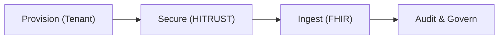

### 3. Distributed Healthcare Landing Zone Topology
Strategically orchestrating clinical workloads across hospital networks, outpatient clinics, and cloud-native health platforms, providing a unified institutional view of global healthcare health and LZ readiness.

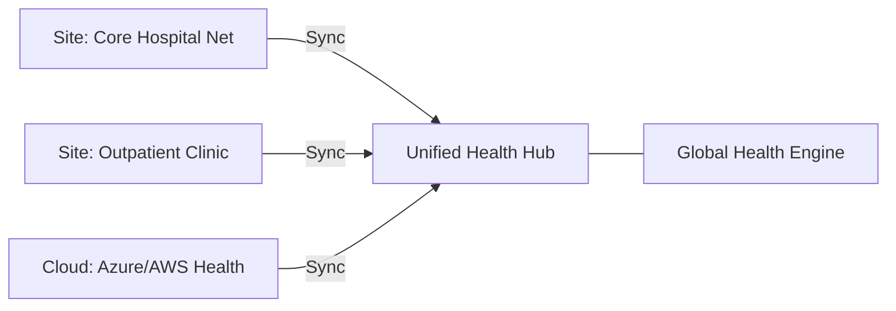

### 4. HL7 & FHIR Data Orchestration Flow
Executing complex logic for securing the bridge between legacy clinical systems and modern API-driven healthcare applications, ensuring every organizational service is discoverable and verified against institutional standards.

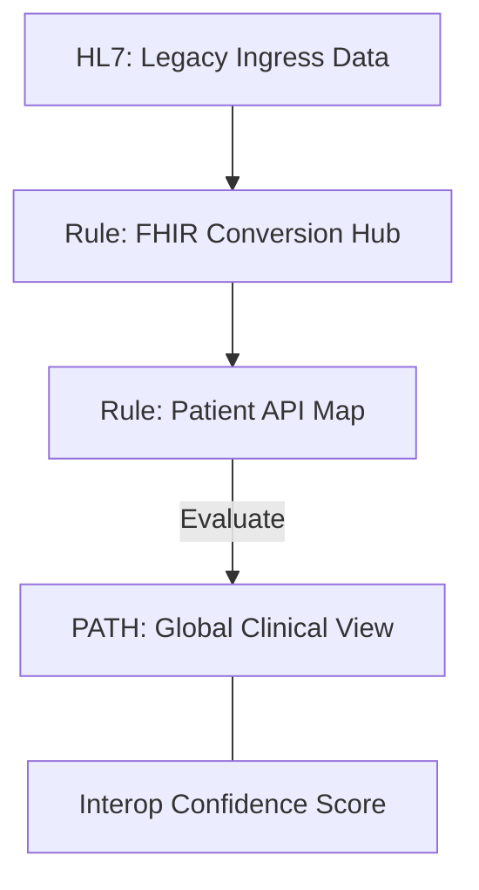

### 5. Multi-Tenant Healthcare Isolation & Governance Flow
Automatically managing tenant isolation and cross-entity data sharing for global healthcare systems, ensuring institutional data residency and security boundaries by default.

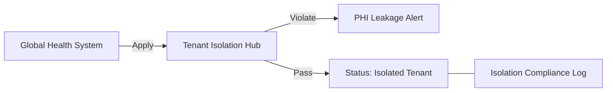

### 6. Encryption & PHI Data Protection Flow
Managing the lifecycle of a PHI request, automatically enforcing institutional encryption standards for PHI at rest and in transit as required by HIPAA/HITRUST, ensuring zero-latency security confidence.

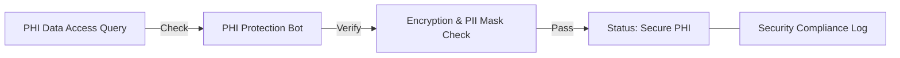

### 7. Institutional Healthcare Maturity Scorecard
Grading organizational performance based on key indicators: PHI Protection Grade, Interoperability Velocity, and Audit Readiness Index.

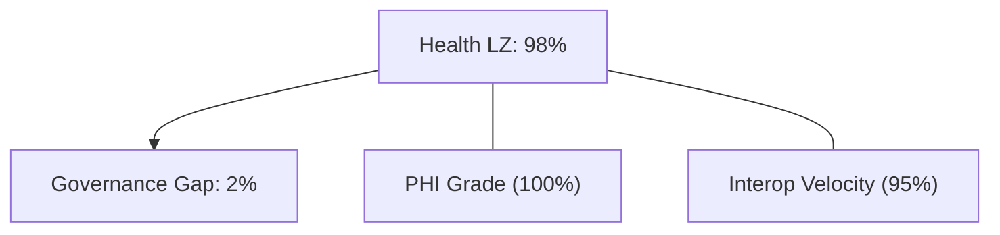

### 8. Identity & RBAC for Healthcare Governance
Managing fine-grained access to clinical hubs, provisioning workers, and audit logs between Clinical Architects, Privacy Officers, and Health Platform Operators.

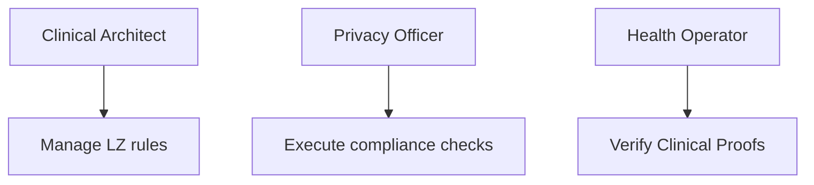

### 9. IaC Deployment: Healthcare-Landing-Zone-as-Code Framework
Using modular Terraform to deploy and manage the versioned distribution of the clinical tracking hubs, PHI protection workers, and forensic metadata lakes.

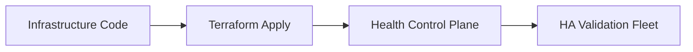

### 10. AIOps Clinical Drift & Risk Validation Flow
Using advanced analytics to identify sudden surges in PHI access, FHIR API anomalies, suspicious configuration drifts, or unusual clinical pattern changes that could result in institutional risk.

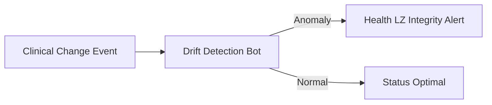

### 11. Metadata Lake for Forensic Healthcare Audit
Storing long-term records of every tenant provisioned, every clinical record accessed, and every compliance event for institutional record-keeping, compliance auditing, and post-provisioning forensics.

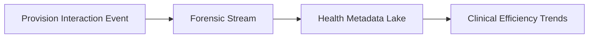

---

## 🏛️ Core Governance Pillars

1.  **Unified Foundation Coordination**: Maximizing resilience by centralizing all clinical measurement through a single institutional plane.
2.  **Automated Tenant Provisioning**: Eliminating "manual tenant" scenarios through proactive orchestration and pattern verification.
3.  **Sequential Interop Intelligence**: Ensuring zero-interruption operations through dependency-aware FHIR-driven data engineering.
4.  **Zero-Trust PHI Protection**: Automatically enforcing identity-based access and rule evaluation across all healthcare tiers.
5.  **Autonomous Operations Logic**: Guaranteeing reliability through automated industry-specific clinical monitoring runbooks.
6.  **Full Clinical Auditability**: Immutable recording of every record access and tenant provision for institutional forensics.

---

## 🛠️ Technical Stack & Implementation

### Healthcare Engine & APIs
*   **Framework**: Python 3.11+ / FastAPI.
*   **FHIR Engine**: Custom Python-based logic for multi-cloud FHIR provisioning and DORA-style clinical metrics.
*   **Integrations**: Native connectors for Epic/Cerner EHRs, FHIR APIs, Azure Health Data Services, and AWS HealthLake.
*   **Persistence**: PostgreSQL (Clinical Ledger) and Redis (Live Health State).
*   **Auth Orchestrator**: Federated OIDC/SAML for least-privilege clinical management access.

### Governance Dashboard (UI)
*   **Framework**: React 18 / Vite.
*   **Theme**: Dark, Teal, Indigo (Modern high-fidelity clinical aesthetic).
*   **Visualization**: D3.js for health topologies and Recharts for interop velocity analytics.

### Infrastructure & DevOps
*   **Runtime**: AWS EKS or Azure Kubernetes Service (AKS) for management plane.
*   **Health Hub**: Managed event sourcing for immutable clinical security timeline reconstruction.
*   **IaC**: Modular Terraform for deploying the healthcare landing zone and validation fleet.

---

## 🏗️ IaC Mapping (Module Structure)

| Module | Purpose | Real Services |
| :--- | :--- | :--- |
| **`infrastructure/health_hub`** | Central management plane | EKS, PostgreSQL, Redis |
| **`infrastructure/tenants`** | Distributed tenant provisioners | K8s Workers, Cloud APIs |
| **`infrastructure/fhir_pipes`** | Clinical Data Ingestion Hubs | FHIR APIs, Lambda |
| **`infrastructure/auditing`** | Forensic clinical sinks | S3, Athena, Quicksight |

---

## 🚀 Deployment Guide

### Local Principal Environment
```bash
# Clone the landing zone platform
git clone https://github.com/devopstrio/healthcare-lz.git
cd healthcare-lz

# Configure environment
cp .env.example .env

# Launch the Health LZ stack
make init

# Trigger a mock tenant provisioning and automated PHI guardrail validation simulation
make simulate-health
```

Access the Management Portal at `http://localhost:3000`.

---

## 📜 License
Distributed under the MIT License. See `LICENSE` for more information.

---
<div align="center">
  <p>© 2026 Devopstrio. All rights reserved.</p>
</div>
